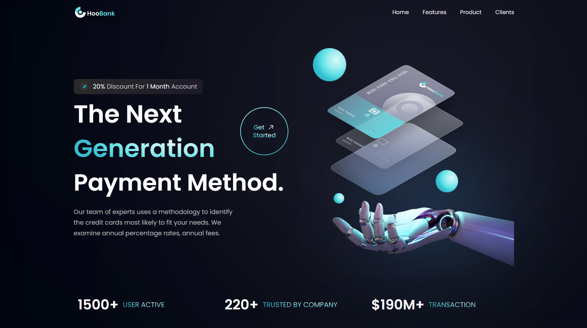

### HooBank

#### Project Preview

#### Description

HooBank is a web application based on a Figma design that provides users with a platform to explore various financial services and products. The application showcases features, user feedback, statistics, and client logos.

The Figma design for this project can be found [here](https://www.figma.com/file/bUGIPys15E78w9bs1l4tgS/HooBank?type=design&node-id=310-485&mode=design)

#### Installation and Configuration

To set up the project locally, follow these steps:

1. Clone the repository to your local machine.
2. Install the required dependencies by running `npm install` or `yarn install`.
3. Start the development server by running `npm start` or `yarn start`.

The application should now be running on `http://localhost:3000`.

#### Contributing

If you'd like to contribute to the project, please feel free to submit a pull request or open an issue to discuss your ideas.
